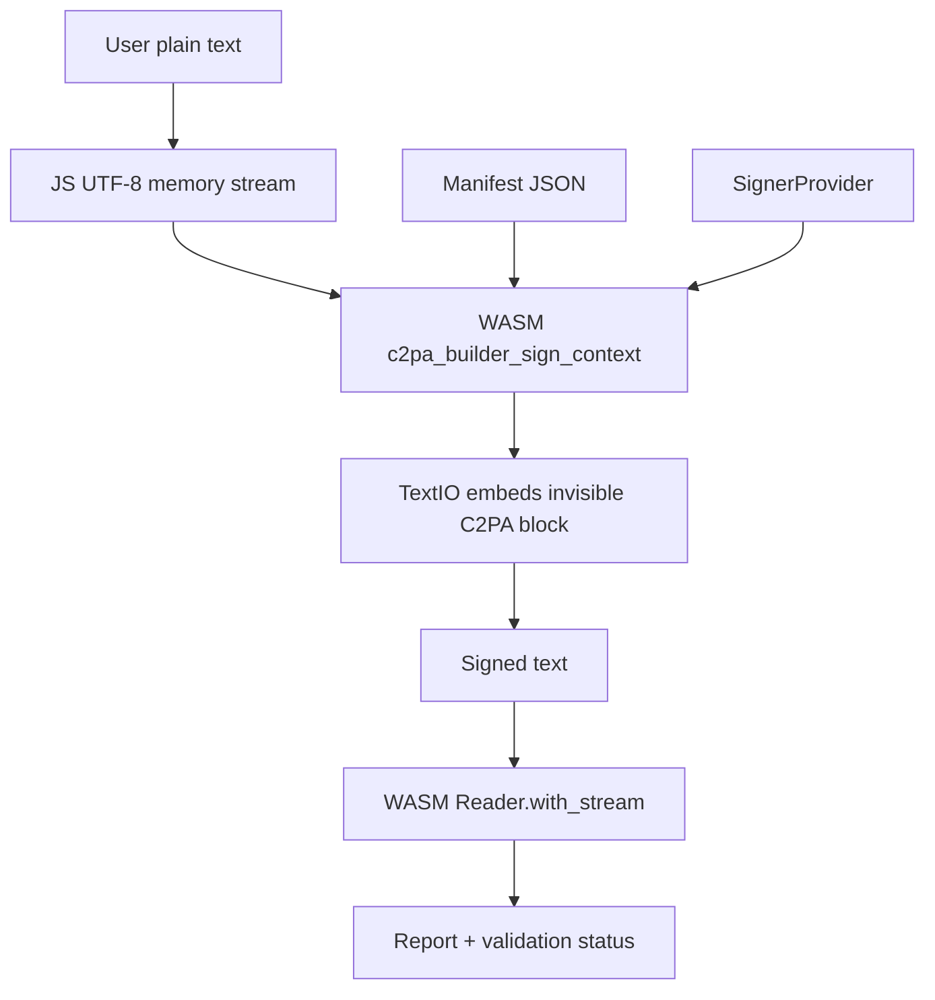

# Text C2PA signing and verification plan

## Current local implementation

The downloaded PR already adds a text asset handler:

- `sdk/src/asset_handlers/text_io.rs` embeds and extracts C2PA JUMBF bytes with `c2pa-text`.
- `sdk/src/jumbf_io.rs` registers `TextIO` in both reader and writer maps.
- `sdk/src/utils/mime.rs` maps `.txt` to `text/plain`.
- `sdk/Cargo.toml` depends on `c2pa-text = "2.0.0"`.

This means the normal SDK stream signing path should be able to sign and read `text/plain` assets:

1. `Builder::sign` / `Builder::save_to_stream`
2. `Store::start_save_stream`
3. `save_jumbf_to_stream("text/plain", ...)`
4. `TextIO::write_cai`
5. `Reader::with_stream("text/plain", ...)`
6. `TextIO::read_cai`

## Main issues found

### 1. End-to-end text signing tests are missing

`TextIO` has unit tests for raw embedding and extraction, but there is no complete test that signs text through `Builder::sign`, then verifies with `Reader::with_stream`.

Without this test, the handler can pass standalone round-trip tests while still failing full C2PA hard-binding validation.

### 2. Existing legacy unsupported text test is stale

`sdk/src/store.rs` still contains ignored/older tests around `unsupported_type.txt` and `text/plain`.

Those tests predate the new text handler and should be updated or replaced with positive tests for embedded text C2PA.

### 3. `TextIO::get_object_locations_from_stream` depends on extracted offsets

Full signing uses `DataHash` and excludes the embedded C2PA block. For text, the exclusion range comes from `c2pa_text::extract_manifest`.

This is the most important correctness point: the offset and length must be byte offsets in the UTF-8 string, not character positions. If they are character positions, verification will fail for non-ASCII text.

Required tests:

- ASCII text signing verifies.
- Chinese/emoji text signing verifies.
- Signed text tampering fails validation.
- Re-signing replaces the old embedded manifest and verifies.

### 4. Embeddable APIs are not text-ready

`Builder::placeholder`, `Builder::sign_embeddable`, and C FFI embeddable APIs call `Store::get_composed_manifest`.

`Store::get_composed_manifest` requires the format handler to implement `ComposedManifestRef`, but `TextIO` does not implement it.

For a JS/loadable library, avoid the embeddable placeholder path for text initially. Use the normal stream signing API (`c2pa_builder_sign` / `c2pa_builder_sign_context`) and let `TextIO::write_cai` embed the final manifest.

### 5. Browser/WASM signing needs a signer strategy

C2PA signing requires private-key operations. A browser library should not require shipping a private key unless this is explicitly acceptable.

Recommended signer modes:

- Remote signing service: browser sends bytes-to-sign to a backend/KMS/HSM.
- Local development signer: test-only PEM key loaded in browser or Node.
- Server-side signing: Node service uses the JS wrapper around WASM or native binary.

### 6. Official prebuilt `c2patool` is not a deployment target

Because official prebuilt `c2patool` depends on glibc 2.29+, production should not rely on it unless the deployment image satisfies that requirement.

Safer options:

- Build `c2patool` in the target environment.
- Build a static or musl binary if the dependency tree permits it.
- Prefer WASM/JS packaging for the text signing library, avoiding glibc entirely.

## Proposed loadjs library

Package name example: `@your-org/c2pa-text-sign`.

### Public API

```ts
export interface SignTextOptions {
  manifest: object | string;
  signer: SignerProvider;
  title?: string;
  format?: "text/plain";
}

export interface VerifyTextOptions {
  trust?: TrustOptions;
  fetchRemoteManifests?: boolean;
}

export interface SignTextResult {
  signedText: string;
  manifestBytes: Uint8Array;
  report: C2paReport;
}

export interface VerifyTextResult {
  valid: boolean;
  report: C2paReport;
  validationStatus: ValidationStatus[];
  activeManifest?: object;
}

export async function signText(
  plainText: string,
  options: SignTextOptions,
): Promise<SignTextResult>;

export async function verifyText(
  signedText: string,
  options?: VerifyTextOptions,
): Promise<VerifyTextResult>;

export async function removeSignature(signedText: string): Promise<string>;
```

### Runtime architecture



### Sign flow

1. Normalize input to UTF-8 string.
2. Build manifest JSON with `format: "text/plain"` and title.
3. Create source and destination in-memory `C2paStream`.
4. Create `Builder` from manifest JSON.
5. Configure `Context` with signer and validation settings.
6. Call `c2pa_builder_sign_context(builder, "text/plain", source, dest, &manifestBytes)`.
7. Decode destination bytes as UTF-8 signed text.
8. Immediately verify the signed text and return both text and report.

### Verify flow

1. Encode signed text as UTF-8 bytes.
2. Create an in-memory stream.
3. Call `Reader::with_stream("text/plain", stream)`.
4. Return `reader.json()` plus validation status.
5. Treat success as valid only when no hard-binding/signature validation errors exist.

## Implementation steps

1. Add full SDK tests for text `Builder::sign` + `Reader::with_stream`.
2. Add non-ASCII and tamper tests for byte-offset correctness.
3. Update stale text unsupported tests.
4. Add a minimal WASM/JS wrapper around the C FFI stream APIs.
5. Add a `SignerProvider` abstraction with remote signing as the default production path.
6. Package browser and Node builds.
7. Add CI builds that do not rely on prebuilt `c2patool`.

## Verification policy

For user-facing verification, do not only check that a manifest exists. A text asset is verified only if:

- The embedded manifest can be extracted.
- The COSE signature validates.
- The signing certificate or identity chain passes the configured trust policy.
- The `c2pa.hash.data` assertion matches the current text after excluding the embedded C2PA block.
- No active-manifest validation status has severity `error`.

If trust anchors are unavailable, return a separate state such as `cryptographicallyValidButUntrusted`, not `valid`.
