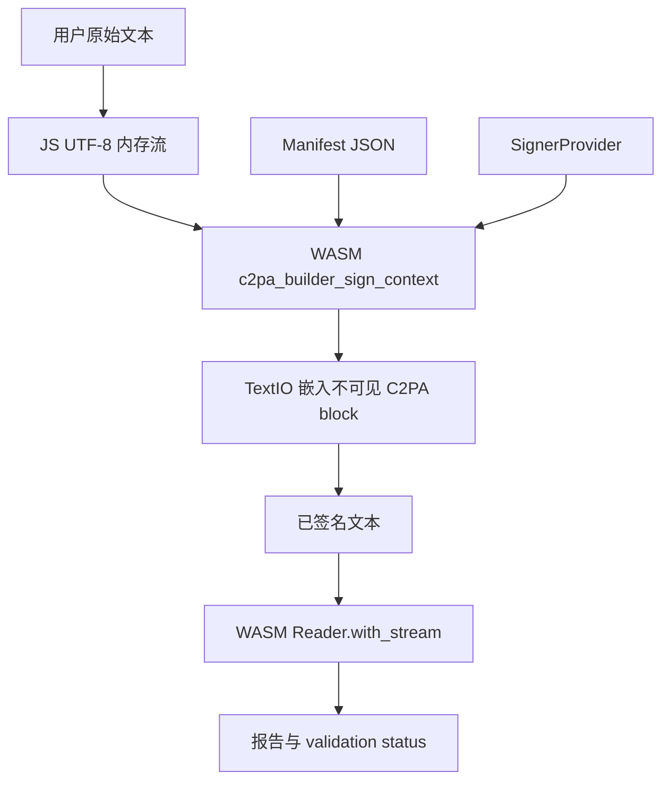

# 文本 C2PA 签名与验证方案

## 当前本地实现情况

当前下载到项目里的 PR 已经加入了文本资产处理器：

- `sdk/src/asset_handlers/text_io.rs` 使用 `c2pa-text` 将 C2PA JUMBF 数据嵌入到纯文本中，也可以从纯文本中提取出来。
- `sdk/src/jumbf_io.rs` 已经把 `TextIO` 注册进 reader 和 writer map。
- `sdk/src/utils/mime.rs` 已经把 `.txt` 映射为 `text/plain`。
- `sdk/Cargo.toml` 已经依赖 `c2pa-text = "2.0.0"`。

也就是说，SDK 的普通 stream 签名路径理论上已经可以处理 `text/plain`：

1. `Builder::sign` / `Builder::save_to_stream`
2. `Store::start_save_stream`
3. `save_jumbf_to_stream("text/plain", ...)`
4. `TextIO::write_cai`
5. `Reader::with_stream("text/plain", ...)`
6. `TextIO::read_cai`

## 主要问题

### 1. 缺少文本端到端签名测试

`TextIO` 里有原始嵌入/提取的单元测试，但还缺少完整的端到端测试：

- 通过 `Builder::sign` 或 `Builder::save_to_stream` 签名文本。
- 再通过 `Reader::with_stream` 读取并验证。

如果没有这个测试，handler 自己的 round-trip 可能通过，但完整 C2PA hard-binding 验证仍然可能失败。

### 2. 旧的 unsupported text 测试已经过时

`sdk/src/store.rs` 里仍然有围绕 `unsupported_type.txt` 和 `text/plain` 的旧测试/忽略测试。

这些测试是文本 handler 加入之前的逻辑，现在应该更新或替换成正向测试：确认嵌入式文本 C2PA 可以签名、读取、验证。

### 3. `TextIO::get_object_locations_from_stream` 的 offset 正确性很关键

完整签名时会使用 `DataHash`，并且需要排除文本里嵌入的 C2PA block。对于文本格式，这个排除范围来自 `c2pa_text::extract_manifest` 返回的 `offset` 和 `length`。

这里最关键的是：`offset` 和 `length` 必须是 UTF-8 字节偏移，而不是字符偏移。否则只要文本里有中文、emoji 等非 ASCII 字符，验证就可能失败。

必须补的测试包括：

- ASCII 文本签名后能验证通过。
- 中文/emoji 文本签名后能验证通过。
- 签名后修改可见文本，验证应失败。
- 对已签名文本重新签名，应替换旧 manifest 并验证通过。

### 4. embeddable API 暂时不适合文本

`Builder::placeholder`、`Builder::sign_embeddable` 和 C FFI 里的 embeddable API 会调用 `Store::get_composed_manifest`。

但 `Store::get_composed_manifest` 要求格式 handler 实现 `ComposedManifestRef`，目前 `TextIO` 没有实现这个 trait。

所以如果要做 JS/loadjs 库，第一版不要走 embeddable placeholder 路线。建议直接走普通 stream signing API：

- `c2pa_builder_sign`
- 或 `c2pa_builder_sign_context`

让 `TextIO::write_cai` 负责把最终签好的 manifest 嵌入文本。

### 5. 浏览器/WASM 签名需要明确 signer 策略

C2PA 签名需要私钥操作。浏览器库不应该默认把私钥发到前端，除非这是明确接受的部署模式。

推荐支持三种 signer 模式：

- 远程签名服务：浏览器把待签名 bytes 发给后端/KMS/HSM，由后端签名。
- 本地开发 signer：仅用于测试，把 PEM key 加载到浏览器或 Node 环境。
- 服务端签名：Node 服务通过 JS wrapper 调用 WASM 或 native binary 完成签名。

### 6. 官方预编译 `c2patool` 不适合作为唯一部署依赖

官方提供的预编译 `c2patool` 依赖 glibc 2.29+。如果部署环境不满足这个要求，就不能直接依赖该二进制。

更稳妥的方案：

- 在目标部署环境里重新编译 `c2patool`。
- 如果依赖允许，编译 static/musl 版本。
- 对文本签名库优先采用 WASM/JS 包装，尽量避开 glibc 依赖。


## 这个 PR 是否能满足我们的目标

结论：这个 PR 可以作为基础继续扩展，但还不能直接满足“完整文本 C2PA 签名工具 + loadjs 库 + 用户侧验证”的最终要求。

它已经解决了最核心的一块：让 `c2pa-rs` 认识 `text/plain`，并且提供文本内嵌/提取 C2PA manifest 的 handler。因此，如果只看 SDK 内部能力，它已经具备实现文本签名的基础。

但它还没有完成产品化所需的完整链路，主要缺口如下。

### 已经可用的部分

- 文本嵌入：`TextIO::write_cai` 会通过 `c2pa-text` 把 JUMBF manifest 编码成不可见 Unicode variation selectors，并嵌入原始文本。
- 文本提取：`TextIO::read_cai` 可以从已签名文本中提取 manifest。
- SDK 注册：`TextIO` 已加入 reader/writer handler map，`text/plain` 和 `txt` 能被分发到文本 handler。
- 普通签名路径：理论上可以走 `Builder::sign` / `Builder::save_to_stream` 完成文本签名。
- 普通读取路径：理论上可以走 `Reader::with_stream("text/plain", ...)` 读取和验证文本。

### 还不能直接满足要求的地方

#### 1. 缺少完整端到端验证

当前 PR 主要验证的是 `TextIO` 自己能不能嵌入和提取 manifest，但缺少完整测试：

- 用 `Builder` 真实生成 C2PA manifest。
- 写入文本。
- 再用 `Reader` 读取。
- 验证 COSE 签名、DataHash hard-binding 和 validation status。

这意味着它“看起来能嵌入”，但还没有证明“签名后的文本真的能被 C2PA 验证链路接受”。

#### 2. 非 ASCII 文本风险没有被覆盖

文本签名最容易出问题的是 byte offset。

C2PA 的 `DataHash` 验证需要排除嵌入的 C2PA block。如果 `c2pa-text` 返回的是字符偏移，而 SDK 按字节偏移使用，那么中文、emoji 等非 ASCII 文本会导致 hash 不一致。

所以必须增加中文/emoji 的端到端签名验证测试。

#### 3. embeddable/loadjs 路线暂时不完整

如果我们想在 loadjs 里走 `placeholder` / `sign_embeddable` 这种“调用方自己嵌入 manifest”的流程，目前会卡住。

原因是：

- `Builder::placeholder` 和 `Builder::sign_embeddable` 会调用 `Store::get_composed_manifest`。
- `Store::get_composed_manifest` 要求格式 handler 实现 `ComposedManifestRef`。
- 当前 `TextIO` 没有实现 `ComposedManifestRef`。

所以第一版 loadjs 不建议走 embeddable API，而应该直接走普通 stream signing API，让 SDK 内部调用 `TextIO::write_cai` 完成嵌入。

#### 4. 还没有 JS/WASM 包装层

PR 只是在 Rust SDK 内增加文本 handler，并没有产出我们需要的 loadjs 库。

还需要新增：

- WASM 或 Emscripten 构建产物。
- JS/TS API 包装。
- 内存 stream 封装。
- `signText`、`verifyText`、`removeSignature` 等高层 API。
- browser / Node 两套加载方式。

#### 5. 签名 signer 方案还需要产品决策

浏览器侧不能随便放私钥。PR 只提供 SDK 能力，没有解决签名密钥如何管理的问题。

我们还需要决定：

- 是否使用远程签名服务。
- 是否接 KMS/HSM。
- 是否允许本地 PEM 私钥，仅用于开发测试。
- 用户侧验证时采用什么 trust policy。

#### 6. 部署问题仍需单独处理

PR 不解决官方预编译 `c2patool` 的 glibc 2.29+ 依赖问题。

如果最终工具依赖 `c2patool`，仍然需要重新编译或做静态/兼容构建。更推荐对文本签名库走 WASM/JS 包装，减少 glibc 依赖。

## 推荐判断

建议在这个 PR 的基础上继续扩展，而不是重写。

原因：

- 它已经接入了 c2pa-rs 的标准 AssetIO 机制，这是最关键的基础设施。
- 它复用了 `c2pa-text`，没有自己发明文本编码格式。
- 普通 `Builder` / `Reader` 流程理论上可以打通。
- 后续问题主要是测试补齐、JS 包装、signer 策略和产品化封装，不是底层方向错误。

但在进入 loadjs 开发前，应该先完成两件事：

1. 在 Rust SDK 层跑通文本端到端签名验证测试。
2. 确认中文/emoji 文本的 hash 排除区间是字节 offset，验证不会误报失败。

只有这两点通过后，才建议把它作为 loadjs 的底座。
## 建议的 loadjs 库设计

包名示例：`@your-org/c2pa-text-sign`。

### 对外 API

```ts
export interface SignTextOptions {
  manifest: object | string;
  signer: SignerProvider;
  title?: string;
  format?: "text/plain";
}

export interface VerifyTextOptions {
  trust?: TrustOptions;
  fetchRemoteManifests?: boolean;
}

export interface SignTextResult {
  signedText: string;
  manifestBytes: Uint8Array;
  report: C2paReport;
}

export interface VerifyTextResult {
  valid: boolean;
  report: C2paReport;
  validationStatus: ValidationStatus[];
  activeManifest?: object;
}

export async function signText(
  plainText: string,
  options: SignTextOptions,
): Promise<SignTextResult>;

export async function verifyText(
  signedText: string,
  options?: VerifyTextOptions,
): Promise<VerifyTextResult>;

export async function removeSignature(signedText: string): Promise<string>;
```

### 运行时架构



### 签名流程

1. 将输入统一为 UTF-8 字符串。
2. 构造 manifest JSON，设置 `format: "text/plain"` 和 title。
3. 创建 source/destination 两个内存 `C2paStream`。
4. 通过 manifest JSON 创建 `Builder`。
5. 在 `Context` 中配置 signer 和验证设置。
6. 调用 `c2pa_builder_sign_context(builder, "text/plain", source, dest, &manifestBytes)`。
7. 将 destination bytes 解码为 UTF-8，得到已签名文本。
8. 立即对签名结果做一次验证，并返回 signed text 与 report。

### 验证流程

1. 将已签名文本编码为 UTF-8 bytes。
2. 创建内存 stream。
3. 调用 `Reader::with_stream("text/plain", stream)`。
4. 返回 `reader.json()` 与 validation status。
5. 只有在没有 hard-binding/signature 错误时，才认为验证通过。

## 建议实施步骤

1. 增加 SDK 端到端测试：`Builder::sign` + `Reader::with_stream`。
2. 增加非 ASCII 与篡改测试，确认 byte offset 正确。
3. 更新旧的 text unsupported 测试。
4. 基于 C FFI stream API 做最小 WASM/JS wrapper。
5. 增加 `SignerProvider` 抽象，生产默认使用远程签名。
6. 输出 browser 和 Node 两种包。
7. CI 构建不要依赖官方预编译 `c2patool`。

## 验证策略

面向用户的验证不能只检查“是否存在 manifest”。一个文本资产只有同时满足以下条件，才应该被认为验证通过：

- 能从文本中提取嵌入的 manifest。
- COSE 签名验证通过。
- 签名证书或身份链符合配置的 trust policy。
- `c2pa.hash.data` 与当前文本匹配，且计算时正确排除了嵌入的 C2PA block。
- active manifest 没有 severity 为 `error` 的 validation status。

如果没有配置信任锚，建议不要返回简单的 `valid: true`，而是返回类似 `cryptographicallyValidButUntrusted` 的状态，表示“密码学签名有效，但身份/证书未被信任”。